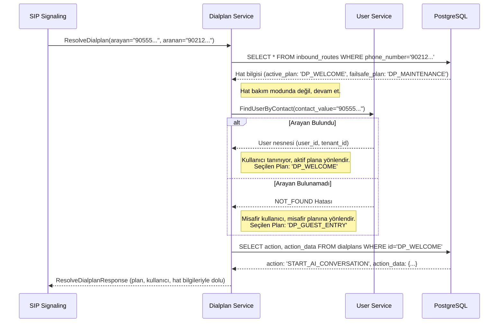

# 🗺️ Sentiric Dialplan Service - Mantık ve Akış Mimarisi

**Belge Amacı:** Bu doküman, `dialplan-service`'in Sentiric platformunun **stratejik karar merkezi** olarak rolünü, bir çağrıya nasıl bir "plan" atadığını ve bu kararı verirken hangi servislerle nasıl etkileşimde bulunduğunu açıklar.

---

## 1. Stratejik Rol: "Akıllı Çağrı Trafik Polisi"

Bu servisin tek ve en önemli görevi, gelen bir çağrıya "Şimdi ne yapmalıyız?" sorusuna anında ve doğru bir cevap vermektir. Çağrı akışının ilk ve en kritik kararını bu servis alır.

**Bu servis sayesinde platform:**
1.  **Dinamik Olur:** Çağrıların nasıl ele alınacağı kodun içine gömülü değildir. Veritabanındaki basit kurallarla, bir telefon numarasının davranışını anında değiştirebilirsiniz (örn: mesai dışı saatlerde sesli mesaja yönlendirme).
2.  **Bağlama Duyarlı Olur:** Karar verirken sadece aranan numarayı değil, aynı zamanda arayanın kim olduğunu (`user-service`'ten gelen bilgi) ve hattın mevcut durumunu (bakım modu vb.) dikkate alır.
3.  **Sorumlulukları Ayrıştırır:** `sip-signaling-service` sadece "postacı" görevi görürken, `agent-service` sadece "uygulayıcı" olur. Karar verme yükü tamamen bu servistedir.

---

## 2. Temel Çalışma Prensibi: Kural Tabanlı Karar Motoru

Servis, `sip-signaling`'den bir `ResolveDialplan` isteği aldığında, bir dizi kuralı sırayla uygular:

1.  **Hat Sorgulama:** Aranan numarayı (`destination_number`) veritabanındaki `inbound_routes` tablosunda arar.
2.  **Durum Kontrolü:** Bulunan hattın `is_maintenance_mode` gibi özel durumlarını kontrol eder.
3.  **Arayan Sorgulama:** Arayan numarayı (`caller_contact_value`) `user-service`'e sorarak kimliğini tespit eder.
4.  **Kural Eşleştirme:** Bu üç bilgiyi (Hat, Durum, Arayan) birleştirerek en uygun `dialplan_id`'yi seçer.
5.  **Planı Getirme:** Seçilen `dialplan_id`'nin detaylarını (`action`, `action_data`) `dialplans` tablosundan okur.
6.  **Yanıt Döndürme:** Tüm bu bilgileri içeren zengin bir `ResolveDialplanResponse` mesajını `sip-signaling`'e geri döner.

---

## 3. Uçtan Uca Karar Akışı: Bir Çağrının Kaderi

Bir çağrı geldiğinde, `dialplan-service`'in karar verme süreci şöyledir:

